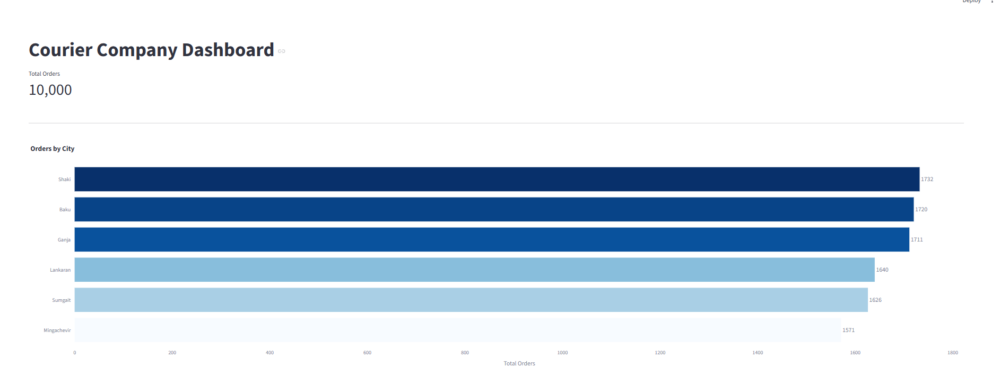
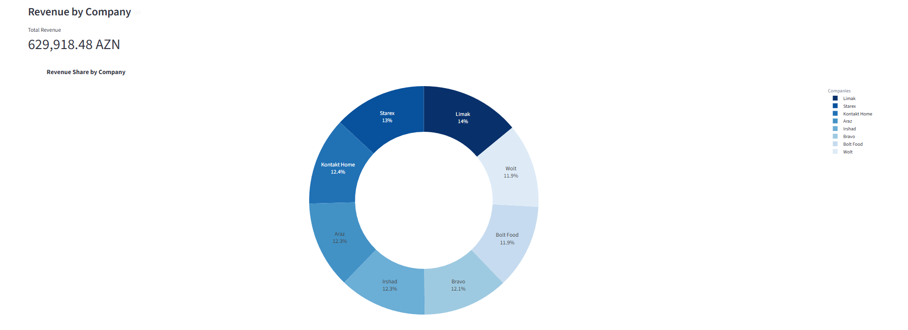
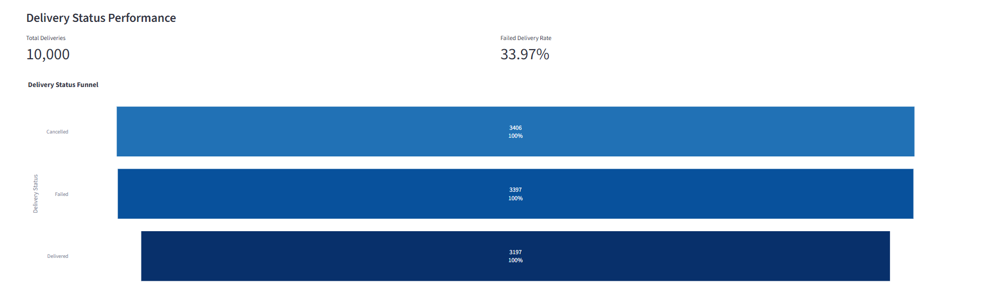
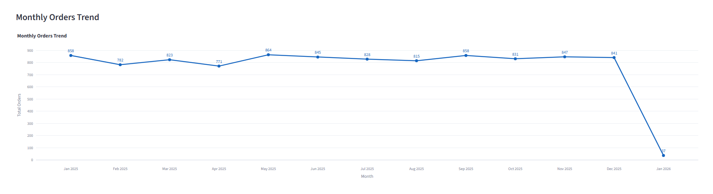
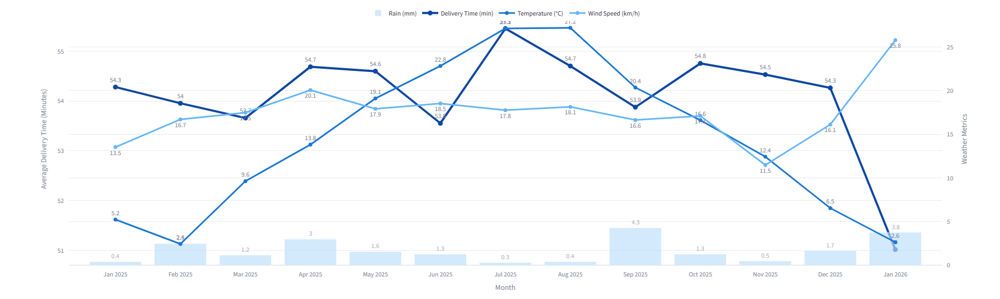

# Courier Data Pipeline

## Overview

This project is an end-to-end data pipeline built for a courier company.

The project generates customer, company and order datasets, collects weather data from an API, stores all information in PostgreSQL, processes the data using Apache Airflow ETL pipelines and visualizes business insights with a Streamlit dashboard.

---

## Workflow

```text
JSON + CSV + API
        ↓
PostgreSQL
        ↓
Apache Airflow ETL
        ↓
Processed CSV Files
        ↓
Streamlit Dashboard
```

---

## Features

* Orders by City
* Revenue by Company
* Delivery Status Performance
* Monthly Orders Trend
* Weather Impact Analysis

---

## Dashboard Preview

### Orders by City



### Revenue by Company



### Delivery Status



### Monthly Orders Trend



### Weather Impact Analysis



---

## Technologies

* Python
* PostgreSQL
* Pandas
* SQLAlchemy
* Apache Airflow
* Docker
* Streamlit
* Plotly

---

## How to Run

```bash
pip install -r requirements.txt
docker compose up
streamlit run app.py

